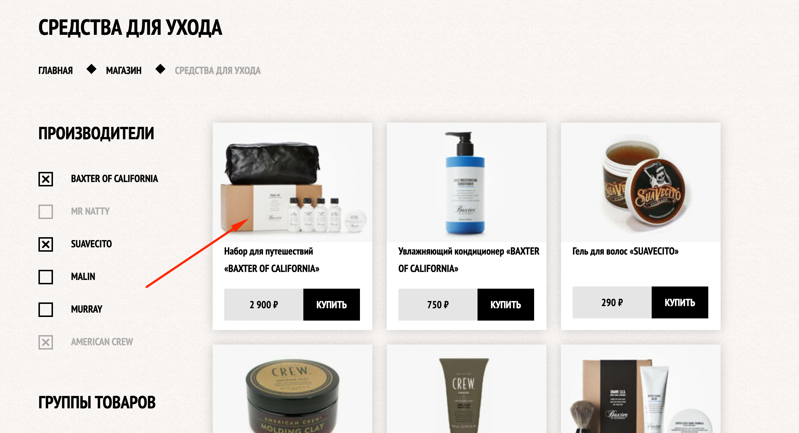

 https://boikoyv.github.io/barbershop/index.html

## **Верстка учебного сайта из нескольких страниц:**

 - Главная;
 - Магазин;
 - Карточка товара;
 - Прайс-лист;
## Детали верстки:

 - На главной странице при нажатии на на ссылку "Вход" - появляется всплывающее окно с формой для входа в личный кабинет. Форма оживлена на JS , реагирует на незаполненные поля ввода. Также присутствует CSS анимация.

- В блоке контактная информация, при нажатии на кнопку "Как проехать" появится всплывающее окно с интерактивной гугл картой.

- В блоке магазин, при нажатии на 1-ую карточку товара ("Набор для путешествий"), откроется страница этого товара с описанием.

